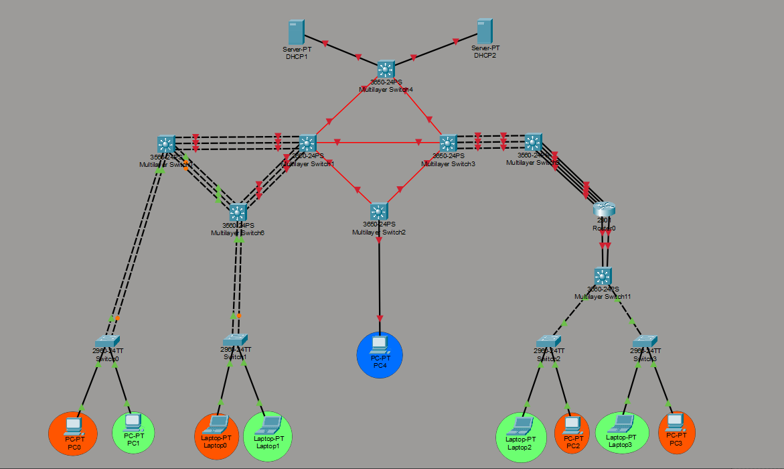

<div align="center">

UNIVERSIDAD SAN CARLOS DE GUATEMALA  
FACULTAD DE INGENIERÍA  
LABORATORIO DE REDES DE COMPUTADORAS 2  
SECCIÓN N  

**Documentación de configuración de red**  
(VLANs, enlaces punto-a-punto, EtherChannel, EIGRP, DHCP, ACLs)

**Estudiante:** Matthew Emmanuel Reyes Melgar  
**Carné:** 202202233  

Guatemala — Marzo 2026

</div>

---

## Índice

- [Documentacion](#documentacion)
  - [Topologia](#topologia)
  - [Tabla Subredes VLANs (192.188.33.0/24 VLSM)](#tabla-subredes-vlans-19218833024-vlsm)
  - [Tabla Enlaces Punto-a-Punto (10.4.33.0/24 FLSM /30)](#tabla-enlaces-punto-a-punto-10433024-flsm-30)
    - [Tabla port channel edificio izquierdo](#tabla-port-channel-edificio-izquierdo)
    - [Tabla para el edificio izquierdo](#tabla-para-el-edificio-izquierdo)
    - [Tabla port channel edificio derecho](#tabla-port-channel-edificio-derecho)
    - [Tabla para el edificio derecho](#tabla-para-el-edificio-derecho)
    - [Tabla para el edificio Central](#tabla-para-el-edificio-central)
    - [Tabla para el edificio de servidores](#tabla-para-el-edificio-de-servidores)
  - [Instrucciones de Uso](#instrucciones-de-uso)
- [Configuración de Switches Edificio Izquierdo](#configuración-de-switches-edificio-izquierdo)
  - [Configuraciones básicas, creación y distribución de vlans](#configuraciones-básicas-creación-y-distribución-de-vlans)
    - [Multislayer Switch 1](#multislayer-switch-1)
    - [Multislayer Switch 0](#multislayer-switch-0)
    - [Multislayer Switch 6](#multislayer-switch-6)
    - [Switch 0](#switch-0)
    - [Switch 1](#switch-1)
  - [Configuraciones de LACP](#configuraciones-de-lacp)
    - [Switch 0](#switch-0-1)
    - [Switch 1](#switch-1-1)
    - [Multislayer Switch 0](#multislayer-switch-0-1)
    - [Multislayer Switch 6](#multislayer-switch-6-1)
    - [Multislayer Switch 1](#multislayer-switch-1-1)
  - [Configuración EIGRP](#configuración-eigrp)
    - [Multislayer Switch 6](#multislayer-switch-6-2)
    - [Multislayer Switch 1](#multislayer-switch-1-2)
    - [Multislayer Switch 0](#multislayer-switch-0-2)
  - [Configuración General DHCP](#configuración-general-dhcp)
    - [Multilayer Switch 0](#multilayer-switch-0)
    - [Multilayer Switch 6](#multilayer-switch-6)
  - [Configuración ACLs](#configuración-acls)
    - [Multislayer Switch 0 y 6](#multislayer-switch-0-y-6)
- [Configuración de Switches Edificio Derecho](#configuración-de-switches-edificio-derecho)
  - [Configuraciones básicas, creación y distribución de vlans](#configuraciones-básicas-creación-y-distribución-de-vlans-1)
    - [Multilayer Switch  11](#multilayer-switch--11)
    - [Switch 2](#switch-2)
    - [Switch 3](#switch-3)
  - [Configuración PagP](#configuración-pagp)
    - [Multislayer Switch 11](#multislayer-switch-11)
    - [Multislayer Switch 5](#multislayer-switch-5)
    - [Multislayer Switch 9](#multislayer-switch-9)
    - [Multislayer Switch 3](#multislayer-switch-3)
  - [Configuración EIGRP](#configuración-eigrp-1)
    - [Multslayer Switch 11](#multslayer-switch-11)
    - [Multslayer Switch 5](#multslayer-switch-5)
    - [Multslayer Switch 9](#multslayer-switch-9)
    - [Multslayer Switch 3](#multslayer-switch-3)
  - [Configuración DHCP](#configuración-dhcp)
    - [Multilayer Switch 11](#multilayer-switch-11)
  - [Configuración ACLs](#configuración-acls-1)
    - [Multilayer Switch 11](#multilayer-switch-11-1)
- [Configuración Switches Central](#configuración-switches-central)
  - [Configuración EIGRP](#configuración-eigrp-2)
    - [Multislayer Switch 2](#multislayer-switch-2)
    - [Multislayer Switchport 1](#multislayer-switchport-1)
    - [Multislayer Switchport 3](#multislayer-switchport-3)
    - [Multislayer Switch 4](#multislayer-switch-4)
  - [Configuración DHCP](#configuración-dhcp-1)
    - [Multilayer Switch 2](#multilayer-switch-2)
- [Edificio con servidores DHCP](#edificio-con-servidores-dhcp)
  - [Configuración de servidores](#configuración-de-servidores)
    - [Servidor DHCP 1](#servidor-dhcp-1)
    - [Servidor DHCP 2](#servidor-dhcp-2)

---

# Documentacion

## Topologia


## Tabla Subredes VLANs (192.188.33.0/24 VLSM)
Asigna gateways en primera usable (SVI o router-on-stick). Usa rangos para PCs/DHCP.

| VLAN | Subred           | Máscara         | Gateway       | PCs (.2-.6 usable) |
| ---- | ---------------- | --------------- | ------------- | ------------------ |
| 10   | 192.188.33.0/29  | 255.255.255.248 | 192.188.33.1  | .2 a .6            |
| 20   | 192.188.33.8/29  | 255.255.255.248 | 192.188.33.9  | .10 a .14          |
| 30   | 192.188.33.16/29 | 255.255.255.248 | 192.188.33.17 | .18 a .22          |
| 40   | 192.188.33.24/29 | 255.255.255.248 | 192.188.33.25 | .26 a .30          |
| 99   | 192.188.33.32/29 | 255.255.255.248 | 192.188.33.33 | .34 a .38          |

Queda espacio libre: 192.188.33.80/24 en adelante para expansiones. 

---
## Tabla Enlaces Punto-a-Punto (10.4.33.0/24 FLSM /30)
Para ~20 enlaces (ej. MAN entre 4 MSW3650: 6 enlaces; Core-Distribución IZQ: 2; inter-VLAN routers; etc.). Cada /30: End A (.1), End B (.2).

10.4.33.0/30

### Tabla port channel edificio izquierdo
| MS | No | Puertos |
|----|----|---------|
| MS1 | 4 | gi1/0/1-3 |
| MS1 | 5 | gi1/0/4-6 |
| MS0 | 1 | fa0/1-2 |
| MS0 | 3 | fa0/3-5 |
| MS0 | 5 | f0/6-8 |
| MS6 | 2 | fa0/1-2 |
| MS6 | 3 | fa0/6-8 |
| MS6 | 4 | f0/3-5 |

### Tabla para el edificio izquierdo
| No. | Subred | Switch1 | No-Portchannel | ip | Switch2 | No-Portchannel | ip |
|-----|--------|---------|----------------|----|---------|----------------|----|
| 1. | 10.4.33.0/30 | MS6 | 4 | 10.4.33.1 | MS1 | 4 | 10.4.33.2 |
| 2. | 10.4.33.4/30 | MS0 | 5 | 10.4.33.5 | MS1 | 5 | 10.4.33.6 |

### Tabla port channel edificio derecho
| MS | No | Puertos |
|----|----|---------|
| MS11 | 6 | fa0/3-4 |
| MS5 | 6 | fa0/1-2 |
| MS5 | 7 | fa0/3-6 |
| MS9 | 7 | fa0/1-4 |
| MS9 | 8 | fa0/5-7 |
| MS3 | 8 | gi1/0/1-3 |

### Tabla para el edificio derecho
| No. | Subred | Switch1 | Portchannel | ip | Switch2 | Portchannel | ip |
|-----|--------|---------|---------|----|---------|---------|----|
| 1. | 10.4.33.8 /30 | M5  | 7 | 10.4.33.9 | MS9 | 7 | 10.4.33.10 |
| 2. | 10.4.33.12/30 | MS9 | 8 | 10.4.33.13 | MS3 | 8 | 10.4.33.14 |
| 3. | 10.4.33.16/30 | MS11 | 6 | 10.4.33.17 | MS5 | 6 | 10.4.33.18 |

### Tabla para el edificio Central
| No. | Subred | Switch1 | Puerto | ip | Switch2 | Puerto | ip |
|-----|--------|---------|---------|----|---------|---------|----|
| 1. | 10.4.33.20/30 | MS2 | gi1/1/1 | 10.4.33.21 | MS1 | gi1/1/1 | 10.4.33.22 |
| 2. | 10.4.33.24/30 | MS2 | gi1/1/2 | 10.4.33.25 | MS3 | gi1/1/1 | 10.4.33.26 |
| 3. | 10.4.33.28/30 | MS1 | gi1/1/2 | 10.4.33.29 | MS3 | gi1/1/2 | 10.4.33.30 |
| 4. | 10.4.33.32/30 | MS1 | gi1/1/3 | 10.4.33.33 | MS4 | gi1/1/1 | 10.4.33.34 |
| 5. | 10.4.33.36/30 | MS4 | gi1/1/2 | 10.4.33.37 | MS3 | gi1/1/3 | 10.4.33.38 |

### Tabla para el edificio de servidores
| No. | Subred | Switch1 | Puerto | ip | Switch2 | Puerto | ip |
|-----|--------|---------|---------|----|---------|---------|----|
| 1. | 10.4.33.40/30 | MS4 | gi1/0/1 | 10.4.33.41 | DHCP1 | fa0 | 10.4.33.42 |
| 2. | 10.4.33.44/30 | MS4 | gi1/0/2 | 10.4.33.45 | DHCP2 | fa0 | 10.4.33.46 |

## Instrucciones de Uso
- Asigna VLANs: 10=NaranjaIZQ, 20=VerdeIZQ, 30=NaranjaDER, 40=VerdeDER, 99=ADMIN.
- En Packet Tracer: configura SVIs en MSW con gateway, pools DHCP con estos rangos (excluye gateway).
- Copia tablas a README.md  

---

# Configuración de Switches Edificio Izquierdo

## Configuraciones básicas, creación y distribución de vlans
### Multislayer Switch 1

```bash
!Configuraciones comunes

enable
conf t
ip routing
hostname MULT_SWITCH_1
banner motd #
*************************************************
* ACCESO RESTRINGIDO - SOLO PERSONAL AUTORIZADO *
*************************************************
#

!STP
spanning-tree mode pvst

do wr
```
### Multislayer Switch 0
```bash
!Configuraciones comunes

enable
conf t
ip routing
hostname MULT_SWITCH_0
banner motd #
*************************************************
* ACCESO RESTRINGIDO - SOLO PERSONAL AUTORIZADO *
*************************************************
#
vtp domain 202202233
vtp password 202202233
vtp version 2
vtp mode client

interface range Fa0/1-8
switchport mode trunk
switchport trunk allowed vlan 10,20
exit

!STP
spanning-tree mode pvst

do wr
```

### Multislayer Switch 6
```bash
!Configuraciones comunes

enable
conf t
ip routing

hostname MULT_SWITCH_6
banner motd #
*************************************************
* ACCESO RESTRINGIDO - SOLO PERSONAL AUTORIZADO *
*************************************************
#
vlan 10
 name VLAN_Naranja_EdificioIZQ_33
vlan 20
 name VLAN_Verde_EdificioIZQ_33
exit

vtp domain 202202233
vtp password 202202233
vtp version 2
vtp mode server

interface range Fa0/1-8
switchport mode trunk
switchport trunk allowed vlan 10,20
exit

!STP
spanning-tree mode pvst

do wr

```

### Switch 0
```bash

enable
conf t
hostname SWITCH_0
banner motd #
*************************************************
*            BIENVENIDO AL SWITCH 0             *
*************************************************
#
vtp domain 202202233
vtp password 202202233
vtp version 2
vtp mode client

interface range Fa0/3-4
switchport mode trunk
switchport trunk allowed vlan 10,20
exit

interface Fa0/1
switchport mode access
switchport access vlan 10

interface Fa0/2
switchport mode access
switchport access vlan 20

!STP
spanning-tree mode pvst

do wr
```

### Switch 1
```bash

enable
conf t
hostname SWITCH_1
banner motd #
*************************************************
*            BIENVENIDO AL SWITCH 1             *
*************************************************
#
vtp domain 202202233
vtp password 202202233
vtp version 2
vtp mode client

interface range Fa0/3-4
switchport mode trunk
switchport trunk allowed vlan 10,20
exit

interface Fa0/1
switchport mode access
switchport access vlan 10

interface Fa0/2
switchport mode access
switchport access vlan 20

!STP
spanning-tree mode pvst

do wr
```

## Configuraciones de LACP

### Switch 0
```bash
enable
conf t
interface range fa0/3 - 4
 channel-group 1 mode active
 switchport mode trunk
 switchport trunk allowed vlan 10,20
exit
interface port-channel 1
 description LACP-SW0-a-MLS0
 switchport mode trunk
 switchport trunk allowed vlan 10,20
end
wr

```
### Switch 1
```bash
enable
conf t
interface range f0/3-4
channel-group 2 mode active
switchport mode trunk
switchport trunk allowed vlan 10,20
exit
interface port-channel 2
decription LACP-SW1-a-MLS6
switchport mode trunk
switchport trunk allowed vlan 10,20
end
wr
```


### Multislayer Switch 0
```bash
enable
conf t

ip routing

interface range fa0/1 - 2
 channel-group 1 mode active
 switchport mode trunk
 switchport trunk allowed vlan 10,20
exit
interface port-channel 1
 description LACP-MLS0-a-SW0
 switchport mode trunk
 switchport trunk allowed vlan 10,20
exit

interface range f0/3-5
 channel-group 3 mode active
 switchport mode trunk
 switchport trunk allowed vlan 10,20
 exit
interface port-channel 3
 description LACP-MLS0-a-MLS6
 switchport mode trunk
 switchport trunk allowed vlan 10,20
exit

interface range fa0/6-8
 channel-protocol lacp
 channel-group 5 mode active
 no switchport
exit
interface port-channel 5
 description LACP-MLS0-a-MLS1
 ip address 10.4.33.5 255.255.255.252
 no shutdown
end
wr


```

### Multislayer Switch 6
```bash
enable
conf t

ip routing

interface range fa0/1 - 2
 channel-group 2 mode active
 switchport mode trunk
 switchport trunk allowed vlan 10,20
exit
interface port-channel 2
 description LACP-MLS6-a-SW1
 switchport mode trunk
 switchport trunk allowed vlan 10,20
exit

interface range f0/6-8
 channel-group 3 mode active
 switchport mode trunk
 switchport trunk allowed vlan 10,20
 exit
interface port-channel 3
 description LACP-MLS6-a-MLS0
 switchport mode trunk
 switchport trunk allowed vlan 10,20
exit

interface range f0/3-5
 channel-protocol lacp
 channel-group 4 mode active
 no switchport
exit
interface port-channel 4
 description LACP-MLS6-a-MLS1
 ip address 10.4.33.1 255.255.255.252
end
wr
```

### Multislayer Switch 1
```bash
interface range Gig1/0/1-3
 channel-protocol lacp
 channel-group 4 mode active
 no switchport
exit
interface port-channel 4
 description LACP-MLS1-a-MLS6
 ip address 10.4.33.2 255.255.255.252
exit

interface range Gig1/0/4-6
 channel-protocol lacp
 channel-group 5 mode active
 no switchport
exit
interface port-channel 5
 description LACP-MLS1-a-MLS0
 ip address 10.4.33.6 255.255.255.252
end
wr
```

## Configuración EIGRP

### Multislayer Switch 6
```bash
interface vlan 10
 ip address 192.188.33.1 255.255.255.248
 no shutdown
interface vlan 20
 ip address 192.188.33.9 255.255.255.248
 no shutdown
exit

router eigrp 1
 network 192.188.33.0 0.0.0.255
 network 10.4.33.0 0.0.0.3 
 no auto-summary
end 
wr
```

### Multislayer Switch 1
```bash

router eigrp 1
 network 10.4.33.0 0.0.0.3
 network 10.4.33.4 0.0.0.3
 no auto-summary
end
wr
```

### Multislayer Switch 0
```bash

interface vlan 10
 ip address 192.188.33.1 255.255.255.248
 no shutdown
interface vlan 20
 ip address 192.188.33.9 255.255.255.248
 no shutdown
exit

router eigrp 1
 network 192.188.33.0 0.0.0.255
 network 10.4.33.4 0.0.0.3
 no auto-summary
end
wr
```

## Configuración General DHCP

### Multilayer Switch 0
```bash
interface vlan 10
 ip helper-address 10.4.33.42
 no shutdown
exit

interface vlan 20
 ip helper-address 10.4.33.42
 no shutdown
end
wr
```

### Multilayer Switch 6
```bash
interface vlan 10
 ip helper-address 10.4.33.42
 no shutdown
exit

interface vlan 20
 ip helper-address 10.4.33.42
 no shutdown
end
wr
```

## Configuración ACLs

### Multislayer Switch 0 y 6
```bash
ip access-list extended VLAN10_ACL
 remark Admin(99)->VLAN10 y reply
 permit icmp 192.188.33.32 0.0.0.7 192.188.33.0 0.0.0.7 echo
 permit icmp 192.188.33.0 0.0.0.7 192.188.33.32 0.0.0.7 echo-reply
 deny icmp 192.188.33.0 0.0.0.7 192.188.33.32 0.0.0.7 echo
 remark VLAN10 <-> VLAN30 (misma color)
 permit ip 192.188.33.0 0.0.0.7 192.188.33.16 0.0.0.7
 permit ip 192.188.33.16 0.0.0.7 192.188.33.0 0.0.0.7
 remark Deny a Verde (20/40) y resto
 deny ip 192.188.33.0 0.0.0.7 192.188.33.8 0.0.0.7
 deny ip 192.188.33.0 0.0.0.7 192.188.33.24 0.0.0.7
 deny ip any any
interface vlan 10
 ip access-group VLAN10_ACL in
exit

ip access-list extended VLAN20_ACL
 remark Admin(99)->VLAN20 y reply
 permit icmp 192.188.33.32 0.0.0.7 192.188.33.8 0.0.0.7 echo
 permit icmp 192.188.33.8 0.0.0.7 192.188.33.32 0.0.0.7 echo-reply
 deny icmp 192.188.33.8 0.0.0.7 192.188.33.32 0.0.0.7 echo
 remark VLAN20 <-> VLAN40 (misma color Verde)
 permit ip 192.188.33.8 0.0.0.7 192.188.33.24 0.0.0.7
 permit ip 192.188.33.24 0.0.0.7 192.188.33.8 0.0.0.7
 remark Deny a Naranja (10/30) y resto
 deny ip 192.188.33.8 0.0.0.7 192.188.33.0 0.0.0.7
 deny ip 192.188.33.8 0.0.0.7 192.188.33.16 0.0.0.7
 deny ip any any
interface vlan 20
 ip access-group VLAN20_ACL in
end
wr

```

---
# Configuración de Switches Edificio Derecho

## Configuraciones básicas, creación y distribución de vlans

### Multilayer Switch  11

```bash

enable
conf t
ip routing
hostname MULT_SWITCH_11
banner motd #
*************************************************
* ACCESO RESTRINGIDO - SOLO PERSONAL AUTORIZADO *
*************************************************
#
!VLANS 

vtp domain 202202233
vtp password 202202233
vtp version 2
vtp mode server

vlan 30
 name VLAN_Naranja_EdificioDER_33
vlan 40
 name VLAN_Verde_EdificioDER_33
exit

interface range Gig0/1-2
switchport mode trunk
switchport trunk allowed vlan 30,40
exit

interface range Fa0/1-2
switchport mode trunk
switchport trunk allowed vlan 30,40

!STP
spanning-tree mode pvst

do wr
```

### Switch 2
```bash

enable
conf t
hostname SWITCH_2
banner motd #
*************************************************
*            BIENVENIDO AL SWITCH 2             *
*************************************************
#
vtp domain 202202233
vtp password 202202233
vtp version 2
vtp mode client

interface range Fa0/3
switchport mode trunk
switchport trunk allowed vlan 30,40
exit

interface Fa0/1
switchport mode access
switchport access vlan 40

interface Fa0/2
switchport mode access
switchport access vlan 30

!STP
spanning-tree mode pvst

do wr
```

### Switch 3
```bash

enable
conf t
hostname SWITCH_3
banner motd #
*************************************************
*            BIENVENIDO AL SWITCH 3             *
*************************************************
#
vtp domain 202202233
vtp password 202202233
vtp version 2
vtp mode client

interface range Fa0/3
switchport mode trunk
switchport trunk allowed vlan 30,40
exit

interface Fa0/1
switchport mode access
switchport access vlan 40

interface Fa0/2
switchport mode access
switchport access vlan 30

!STP
spanning-tree mode pvst

do wr
```

## Configuración PagP

### Multislayer Switch 11
```bash
conf t
ip routing

interface rang fa0/3-4
 no switchport
 channel-group 6 mode desirable
exit

interface port-channel 6
 ip add 10.4.33.17 255.255.255.252
 no shutdown
exit

```

### Multislayer Switch 5

```bash
enable
conf t
hostname MULT_SWITCH_5
banner motd #
*************************************************
*          BIENVENIDO AL MULT_SWITCH 5          *
*************************************************
#

ip routing 

interface rang fa0/1-2
 no switchport
 channel-group 6 mode desirable
exit

interface port-channel 6
 ip add 10.4.33.18 255.255.255.252
 no shutdwon
exit

interface rang fa0/3-6
 no switchport 
 channel-group 7 mode desirable
exit

interface port-channel 7
 ip add 10.4.33.9 255.255.255.252
 no shutdown
end
wr

```

### Multislayer Switch 9

```bash
enable
conf t
hostname MULT_SWITCH_9
banner motd #
*************************************************
*          BIENVENIDO AL MULT_SWITCH 9          *
*************************************************
#

ip routing 

interface rang fa0/1-4
 no switchport 
 channel-group 7 mode desirable
exit

interface port-channel 7
 ip add 10.4.33.10 255.255.255.252
 no shutdown
end
wr

interface rang fa0/5-7
 no switchport 
 channel-group 8 mode desirable
exit

interface port-channel 8
 ip add 10.4.33.13 255.255.255.252
 no shutdown
end
wr

```

### Multislayer Switch 3

```bash
enable
conf t
hostname MULT_SWITCH_3
banner motd #
*************************************************
*          BIENVENIDO AL MULT_SWITCH 3          *
*************************************************
#

ip routing

interface rang gi1/0/1-3 
 no switchport 
 channel-group 8 mode desirable
exit

interface port-channel 8
 ip add 10.4.33.14 255.255.255.252
 no shutdown
end
wr

```

## Configuración EIGRP

### Multslayer Switch 11
```bash
conf t

interface vlan 30
 ip add 192.188.33.17 255.255.255.248
interface vlan 40
 ip add 192.188.33.25 255.255.255.248
exit

router eigrp 1
 network 192.188.33.0 0.0.0.255
 network 10.4.33.16 0.0.0.3
 no auto-summary
 end
wr

```


### Multslayer Switch 5
```bash
conf t

router eigrp 1
 network 10.4.33.16 0.0.0.3
 network 10.4.33.8 0.0.0.3
 no auto-summary
 end
wr

```

### Multslayer Switch 9
```bash
conf t

router eigrp 1
 network 10.4.33.8 0.0.0.3
 network 10.4.33.12 0.0.0.3
 no auto-summary
 end
wr

```

### Multslayer Switch 3
```bash
conf t

router eigrp 1
 network 10.4.33.12 0.0.0.3
 no auto-summary
 end
wr

```

## Configuración DHCP
### Multilayer Switch 11
```bash
interface vlan 30
 ip helper-address 10.4.33.46
 no shutdown
exit

interface vlan 40
 ip helper-address 10.4.33.46
 no shutdown
end
wr
```

## Configuración ACLs
### Multilayer Switch 11
```bash
ip access-list extended VLAN30_ACL
 remark Admin(99)->VLAN30 y reply
 permit icmp 192.188.33.32 0.0.0.7 192.188.33.16 0.0.0.7 echo
 permit icmp 192.188.33.16 0.0.0.7 192.188.33.32 0.0.0.7 echo-reply
 deny icmp 192.188.33.16 0.0.0.7 192.188.33.32 0.0.0.7 echo
 remark VLAN30 <-> VLAN10 (misma color Naranja)
 permit ip 192.188.33.16 0.0.0.7 192.188.33.0 0.0.0.7
 permit ip 192.188.33.0 0.0.0.7 192.188.33.16 0.0.0.7
 remark Deny a Verde (20/40) y resto
 deny ip 192.188.33.16 0.0.0.7 192.188.33.8 0.0.0.7
 deny ip 192.188.33.16 0.0.0.7 192.188.33.24 0.0.0.7
 deny ip any any
interface vlan 30
 ip access-group VLAN30_ACL in
exit
ip access-list extended VLAN40_ACL
 remark Admin(99)->VLAN40 y reply
 permit icmp 192.188.33.32 0.0.0.7 192.188.33.24 0.0.0.7 echo
 permit icmp 192.188.33.24 0.0.0.7 192.188.33.32 0.0.0.7 echo-reply
 deny icmp 192.188.33.24 0.0.0.7 192.188.33.32 0.0.0.7 echo
 remark VLAN40 <-> VLAN20 (misma color Verde)
 permit ip 192.188.33.24 0.0.0.7 192.188.33.8 0.0.0.7
 permit ip 192.188.33.8 0.0.0.7 192.188.33.24 0.0.0.7
 remark Deny a Naranja (10/30) y resto
 deny ip 192.188.33.24 0.0.0.7 192.188.33.0 0.0.0.7
 deny ip 192.188.33.24 0.0.0.7 192.188.33.16 0.0.0.7
 deny ip any any
interface vlan 40
 ip access-group VLAN40_ACL in
end
wr
```


# Configuración Switches Central

## Configuración EIGRP

### Multislayer Switch 2
```bash

enable
conf t
hostname MULT_SWITCH_2
banner motd #
*************************************************
*          BIENVENIDO AL MULT_SWITCH 2          *
*************************************************
#

! Creacion VLAN ADMIN

ip routing

vlan 99
 name ADMIN

! Interfaz para ADMIN
interface vlan 99
 ip add 192.188.33.33 255.255.255.248
 no shutdown

interface gi1/0/1
 switchport mode access
 switchport access vlan 99
 no shutdown
exit

interface gi1/1/1
 no switchport
 ip add 10.4.33.21 255.255.255.252
 no shutdown
exit

interface gi1/1/2
 no switchport
 ip add 10.4.33.25 255.255.255.252
 no shutdown
exit

router eigrp 1
 network 192.188.33.0 0.0.0.255
 network 10.4.33.20 0.0.0.3
 network 10.4.33.24 0.0.0.3
 no auto-summary
end
wr

```

### Multislayer Switchport 1

```bash
interface gi1/1/1
 no switchport
 ip add 10.4.33.22 255.255.255.252
 no shutdown
exit

interface gi1/1/2
 no switchport
 ip add 10.4.33.29 255.255.255.252
 no shutdown
exit

interface gi1/1/3
 no switchport
 ip add 10.4.33.33 255.255.255.252
 no shutdown
exit

router eigrp 1
 network 10.4.33.20 0.0.0.3
 network 10.4.33.28 0.0.0.3
 network 10.4.33.32 0.0.0.3
 no auto-summary
end
wr

```

### Multislayer Switchport 3

```bash
interface gi1/1/1
 no switchport
 ip add 10.4.33.26 255.255.255.252
 no shutdown
exit

interface gi1/1/2
 no switchport
 ip add 10.4.33.30 255.255.255.252
 no shutdown
exit

interface gi1/1/3
 no switchport
 ip add 10.4.33.38 255.255.255.252
 no shutdown
exit

router eigrp 1
 network 10.4.33.24 0.0.0.3
 network 10.4.33.28 0.0.0.3
 network 10.4.33.36 0.0.0.3
 no auto-summary
end
wr

```

### Multislayer Switch 4
```bash

enable
conf t
hostname MULT_SWITCH_4
banner motd #
*************************************************
*          BIENVENIDO AL MULT_SWITCH 4          *
*************************************************
#

ip routing

interface gi1/1/1
 no switchport
 ip add 10.4.33.34 255.255.255.252
 no shutdown
exit

interface gi1/1/2
 no switchport
 ip add 10.4.33.37 255.255.255.252
 no shutdown
exit

interface gi1/0/1
 no switchport
 ip add 10.4.33.41 255.255.255.252
 no shutdown
exit

interface gi1/0/2
 no switchport
 ip add 10.4.33.45 255.255.255.252
 no shutdown
exit

router eigrp 1
 network 10.4.33.32 0.0.0.3
 network 10.4.33.36 0.0.0.3
 network 10.4.33.40 0.0.0.3
 network 10.4.33.44 0.0.0.3
 no auto-summary
end
wr

```

## Configuración DHCP
### Multilayer Switch 2

```bash
interface vlan 99
 ip helper-address 10.4.33.42
 no shutdown
end
wr
```

# Edificio con servidores DHCP
## Configuración de servidores
### Servidor DHCP 1
| VLAN | Gateway | DNS | Start IP Address | SubnetMask | Maximum Number of Users |
|------|---------|-----|------------------|------------|-------------------------|
| 10 | 192.188.33.1 | 0.0.0.0 | 192.188.33.2 | 255.255.255.248 | 4 |
| 20 | 192.188.33.9 | 0.0.0.0 | 192.188.33.10 | 255.255.255.248 | 4 |
| 99 | 192.188.33.33 | 0.0.0.0 | 192.188.33.34 | 255.255.255.248 | 4 |

### Servidor DHCP 2
| VLAN | Gateway | DNS | Start IP Address | SubnetMask | Maximum Number of Users |
|------|---------|-----|------------------|------------|-------------------------|
| 30 | 192.188.33.17 | 0.0.0.0 | 192.188.33.18 | 255.255.255.248 | 4 |
| 40 | 192.188.33.25 | 0.0.0.0 | 192.188.33.26 | 255.255.255.248 | 4 |

