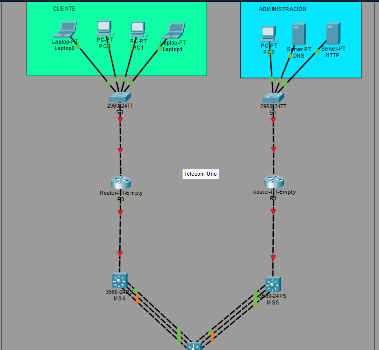
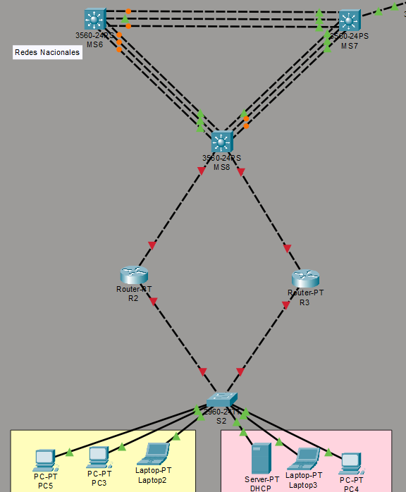
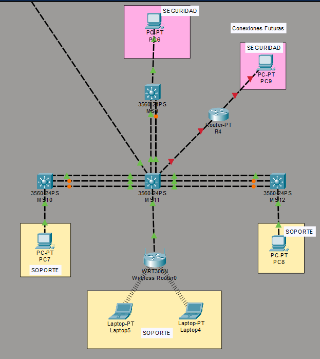
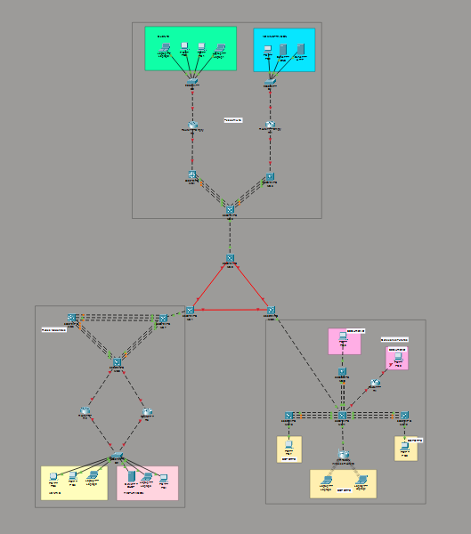

<div align="center">

UNIVERSIDAD SAN CARLOS DE GUATEMALA  
FACULTAD DE INGENIERÍA  
LABORATORIO DE REDES DE COMPUTADORAS 2  
SECCIÓN N  

**Documentación de configuración de red**  
(VLANs, enlaces punto-a-punto, EtherChannel, EIGRP, DHCP, ACLs)

**Estudiante:** Matthew Emmanuel Reyes Melgar  
**Carné:** 202202233  

Guatemala — Marzo 2026

</div>

---

<H1> Índice </H1>

- [Topología](#topología)
  - [TELCOM UNO](#telcom-uno)
  - [Redes Nacionales](#redes-nacionales)
  - [Conexiones Futuras](#conexiones-futuras)
  - [Vista General](#vista-general)
- [Tabla de Subredes](#tabla-de-subredes)
  - [Tabla de relacion VLAN - NOMBRE](#tabla-de-relacion-vlan---nombre)
  - [Tabla ISP 1](#tabla-isp-1)
    - [Tabla Port Channel](#tabla-port-channel)
    - [Tabla Punto a Punto](#tabla-punto-a-punto)
- [Configuraciones](#configuraciones)
  - [ISP1 Telecom Uno](#isp1-telecom-uno)
    - [VLANS](#vlans)
      - [Switch 0](#switch-0)
      - [Switch 1](#switch-1)
    - [OSPF](#ospf)
      - [Router 0](#router-0)
      - [Multilayer Switch 4](#multilayer-switch-4)
      - [Router 1](#router-1)
      - [Multilayer Switch 5](#multilayer-switch-5)
      - [Multilayer Switch 3](#multilayer-switch-3)
    - [DHCP](#dhcp)
      - [R0](#r0)
      - [R1](#r1)

---

# Topología

## TELCOM UNO


## Redes Nacionales


## Conexiones Futuras


## Vista General


# Tabla de Subredes
Asigna gateways en primera usable (SVI o router-on-stick). Usa rangos para PCs/DHCP.

## Tabla de relacion VLAN - NOMBRE

| VLAN | NOMBRE |
|------|--------|
|  10  | CLIENTE |
|  20  | ADMINISTRACION |

## Tabla ISP 1

La red utilizada para esta red es 172.16.13.0/24,

| VLAN | Subred           | Máscara         | Gateway       | PCs (usable) |
| ---- | ---------------- | --------------- | ------------- | ------------------ |
|  10  | 172.16.13.0/28  | 255.255.255.240 | 172.16.13.1  | .2 a .14            |
|  20  | 172.16.13.16/28  | 255.255.255.240 | 172.16.13.17  | .18 a .30            |

### Tabla Port Channel
| MS | No | Puertos |
|----|----|---------|
| MS4 | 1 | fa0/3-4 |
| MS5 | 2 | fa0/5-7 |

### Tabla Punto a Punto

| No. | Subred | Dispositivo | Puerto | ip | Dispositivo | Puerto | ip |
|-----|--------|-------------|--------|----|-------------|--------|----|
| 1. | 172.16.13.0/28 | R0 | fa1/0 | 172.16.13.1 | | | |
| 2. | 172.16.13.32/30 | R0 | fa0/0 | 172.16.13.33 | MS4 | fa0/1 | 172.16.13.34 |
| 3. | 172.16.13.16/28 | R1 | fa1/0 | 172.16.13.17 | | | |
| 2. | 172.16.13.40/30 | R1 | fa0/0 | 172.16.13.41 | MS5 | fa0/1 | 172.16.13.42 |

| No. | Subred | Dispositivo | GROUP | ip | Dispositivo | GROUP | ip |
|-----|--------|-------------|--------|----|-------------|--------|----|
| 1. | 172.16.13.36/30 | MS4 | 1 | 172.16.13.37 | MS3 | 1 | 172.16.13.38 |
| 2. | 172.16.13.44/30 | MS5 | 2 | 172.16.13.45 | MS3 | 2 | 172.16.13.46 |

# Configuraciones

## ISP1 Telecom Uno

### VLANS

#### Switch 0
```bash
enable
conf t
hostname SW0

vlan 10
 name CLIENTE
exit

inter fa0/1
 switchport mode trunk
 switchport trunk allowed vlan all
 no shutdown
exit

inter range fa0/2-5
 switchport mode access
 switchport access vlan 10
 no shutdown
end
wr
```

#### Switch 1
```bash
enable
conf t
hostname SW1

vlan 20
 name ADMINISTRACION
exit

inter fa0/1
 switchport mode trunk
 switchport trunk allowed vlan all
 no shutdown
exit

inter range fa0/2-4
 switchport mode access
 switchport access vlan 20
 no shutdown
end
wr
```

### OSPF
#### Router 0
```bash
enable
conf t
hostname R0

interface fa1/0
 no shutdown
exit

interface fa1/0.10
 encapsulation dot1Q 10
 ip address 172.16.13.1 255.255.255.240
exit

interf fa0/0
 ip add 172.16.13.33 255.255.255.252
 no shutdown
exit

router ospf 1
 router-id 1.1.1.1
 network 172.16.13.0 0.0.0.15 area 0
 network 172.16.13.32 0.0.0.3 area 0

end
wr
```

#### Multilayer Switch 4
```bash
enable
conf t
hostname MS4

ip routing

interf fa0/1
 no switchport
 ip add 172.16.13.34 255.255.255.252
 no shutdown
exit

interface range fa0/3 - 4
 channel-protocol lacp
 channel-group 1 mode active
 no switchport
exit
interface port-channel 1
 no switchport
 description LACP-MS4-a-MS3
 ip add 172.16.13.37 255.255.255.252
 no shutdown
exit

router ospf 1
 router-id 2.2.2.2
 network 172.16.13.32 0.0.0.15 area 0
 network 172.16.13.36 0.0.0.3 area 0
end
wr

```

#### Router 1
```bash
enable
conf t
hostname R1

interface fa1/0
 no shutdown
exit

interface fa1/0.20
 encapsulation dot1Q 20
 ip address 172.16.13.17 255.255.255.240
exit

interf fa0/0
 ip add 172.16.13.41 255.255.255.252
 no shutdown
exit

router ospf 1
 router-id 3.3.3.3
 network 172.16.13.16 0.0.0.15 area 0
 network 172.16.13.40 0.0.0.3 area 0

end
wr
```

#### Multilayer Switch 5
```bash
enable
conf t
hostname MS5

ip routing

interf fa0/1
 no switchport
 ip add 172.16.13.42 255.255.255.252
 no shutdown
exit

interface range fa0/5 - 7
 channel-protocol lacp
 channel-group 2 mode active
 no switchport
exit
interface port-channel 2
 no switchport
 description LACP-MS5-a-MS3
 ip add 172.16.13.45 255.255.255.252
 no shutdown
exit

router ospf 1
 router-id 4.4.4.4
 network 172.16.13.40 0.0.0.3 area 0
 network 172.16.13.44 0.0.0.3 area 0
end
wr

```

#### Multilayer Switch 3
```bash
enable
conf t
hostname MS3

ip routing

interface range fa0/2 - 4
 channel-protocol lacp
 channel-group 1 mode active
 no switchport
exit
interface port-channel 1
 no switchport
 description LACP-MS4-a-MS3
 ip add 172.16.13.38 255.255.255.252
 no shutdown
exit

interface range fa0/5 - 7
 channel-protocol lacp
 channel-group 2 mode active
 no switchport
exit
interface port-channel 2
 no switchport
 description LACP-MS5-a-MS3
 ip add 172.16.13.46 255.255.255.252
 no shutdown
exit

router ospf 1
 router-id 5.5.5.5
 network 172.16.13.36 0.0.0.3 area 0
 network 172.16.13.44 0.0.0.3 area 0
end 
wr

```

### DHCP

#### R0
```bash
conf t
interface fa1/0.10
 ip helper-address 172.16.13.18
end
wr
```

#### R1
```bash
conf t
interface fa1/0.20
 ip helper-address 172.16.13.18
end
wr
```